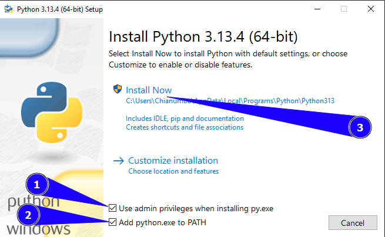

# Setup Your Local Python Development Environment

Setting up your **local Python development environment** is the first step in 
becoming a Python developer. This guide helps you install Python and a code editor that 
you'll use to write Python code on your Computer.

## Why Use a Local Environment Instead of Cloud Tools?

> Real developers build locally. Here’s why:

- The industry uses local development, not sandboxed cloud environments.
- You own your environment. No internet required, no vendor lock-in.
- Total access to your file system, hardware, and editor configuration.
- You’ll learn how Python really works: environments, dependencies, file structure — not just clicking “Run.”

## 🔧 What You'll Need

### 1. **Python**

Download and install Python from [python.org](https://www.python.org/).

#### Install Python on Windows

1. Type `cmd` into the `Start` menu's search bar and open `Command Prompt` from the results.
    
    
2. Type `python --version` into the `Command Prompt` window you've just opened and press <kbd>Enter</kbd>.
    

    !!! note
        **Skip to step 4 below** if the above operation prints an error message 
        about being unable to recognize `'python'`.
        However, if running the above command prints something like `Python 3.x.x`.
        It means Python is already installed on your computer.
        Just skip to the `Install VSCode` section below.

3. Visit [https://www.python.org/downloads](https://www.python.org/downloads) in your web browser.
4. Click the `Download Python 3.x.x` button to download Python to your computer.
    
    

5. When the download completes, open the downloaded file.
6. Check off the `Use admin privileges` and `Add python.ext to PATH` options in the 
    `Install Python 3.x.x` window displayed and click `Install now`.
    
    
 
### 2. Install Visual Studio Code

#### Install Visual Studio Code on Windows
