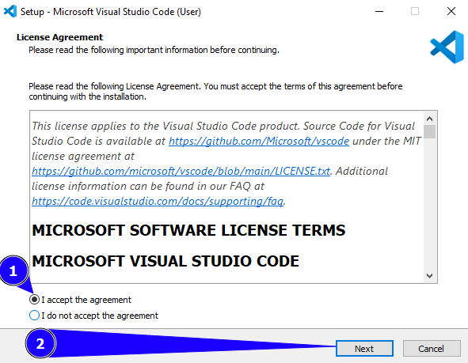
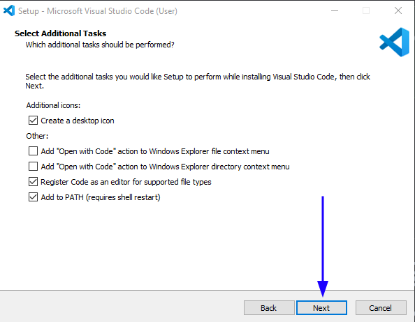
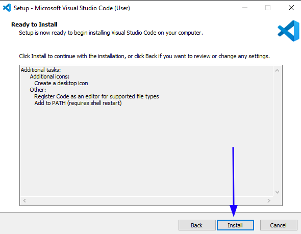
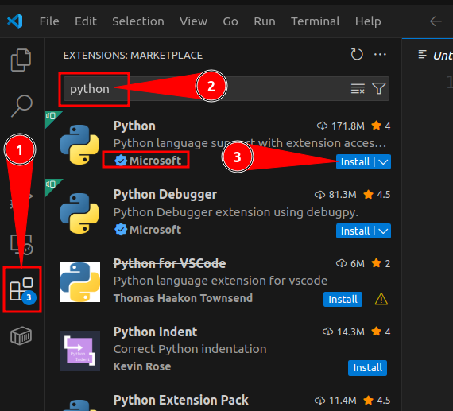

# Install a Code Editor

A code editor, like the name suggests, is used to edit code. Think of it like a *suped* up Microsoft Word or Notepad that is used to write text, except code editors provide software development-specific tools.

Although there are Python-specific code editors out in the wild, it's sufficient to begin with a general purpose code editor such as Visual Studio Code because it is free and has everything you need to get started.

## Install Visual Studio Code on Windows

1. Visit [https://code.visualstudio.com/docs/setup/windows#_install-vs-code-on-windows](https://code.visualstudio.com/docs/setup/windows#_install-vs-code-on-windows).
2. Click the `Visual Studio Code installer` link in the first step of the `Use a Windows installer` section and wait for the download to begin/complete.
    
    > Download the `Visual Studio Code installer` for Windows

3. Double click the downloaded file.
4. Accept Visual Studio Code's license agreement and click `Next`.
    
    

5. Click `Next` on the `Select additional tasks` window. 

    

6. Click `Install` on the `Ready to install` window.

    

7. Launch Visual Studio Code after the installation completes.
8. Click the extensions button on the left side bar, type `python` into the side bar, 
    and install the `Python` **extension by Microsoft**.

    
