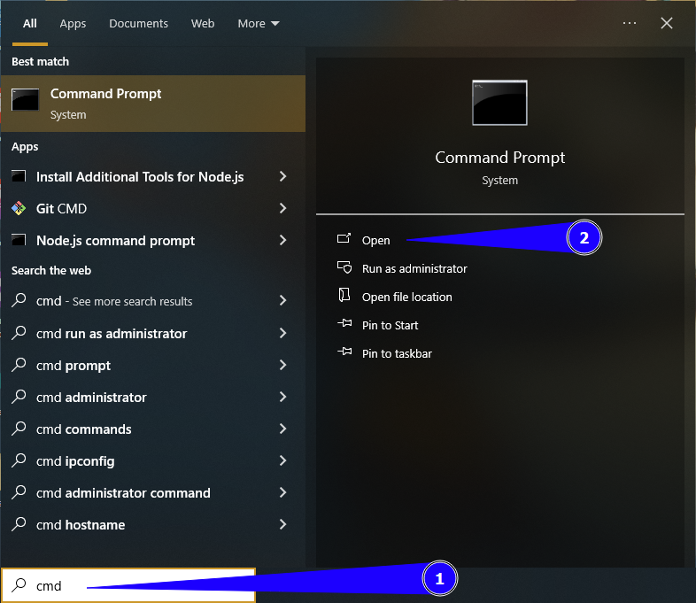

# Install Python on Your Computer 

## Install Python on a Windows PC

1. Type `cmd` into the `Start` menu's search bar and open `Command Prompt` from the results.
    
    
2. Type `python --version` into the `Command Prompt` window you've just opened and press <kbd>Enter</kbd>.
    

    !!! note
        **Skip to step 3 below** if the above operation prints an error message 
        about being unable to recognize `'python'`.
        However, if running the above command prints something like `Python 3.x.x`.
        It means Python is already installed on your computer.
        Just skip to the [install a code editor](/install-code-editor) page.

3. Visit [https://www.python.org/downloads](https://www.python.org/downloads) in your web browser.
4. Click the `Download Python 3.x.x` button to download Python to your computer.
    
    

5. When the download completes, open the downloaded file.
6. Check off the `Use admin privileges` and `Add python.ext to PATH` options in the 
    `Install Python 3.x.x` window displayed and click `Install now`.
    
    

7. Repeat steps `1` and `2` above. It should print something like to `Python 4.x.x` if you've installed 
    it correctly.
